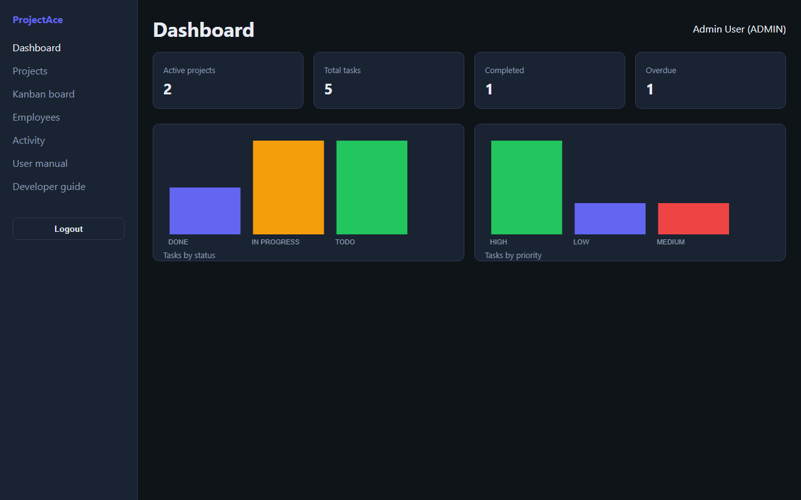

# ProjectAce — SaaS Project Management POC

**Trello-style Kanban, role-based access, and analytics dashboard** — a lightweight full-stack proof-of-concept for managing projects, tasks, and teams.



> Flask + SQLite POC with JWT auth, Admin / Manager / Employee roles, drag-and-drop Kanban board, dashboard charts, activity log, and seeded demo data.

## Quick start (Windows)

1. **install.bat** — creates `.venv`, installs deps, copies `.env.example` → `.env`
2. **start.bat** — runs the app at http://localhost:5001
3. **stop.bat** — stops the server on port 5001

## Install (PowerShell)

```powershell
python -m venv .venv
.\.venv\Scripts\Activate.ps1
pip install -r requirements.txt
copy .env.example .env
python run.py
```

Open **http://localhost:5001** · [User manual](docs/user-manual.html) · [Future plan](future-plan.html)

## Demo logins

| Role     | Email                     | Password     |
|----------|---------------------------|--------------|
| Admin    | admin@projectace.local    | admin123     |
| Manager  | manager@projectace.local  | manager123   |
| Employee | employee@projectace.local | employee123  |

## Test

```powershell
pytest tests/ -v
```

## Features

- JWT login with RBAC (Admin, Manager, Employee)
- Project list and Kanban board (To Do → In Progress → Done)
- Dashboard stat cards and status/priority charts
- Employee list (Admin), activity log, notifications
- HTML user manual included
